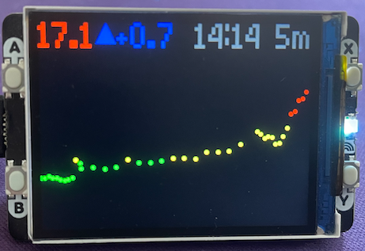

# PicoCGM

A Raspberry Pi Pico W based display for [Nightscout](https://nightscout.github.io/) CGM-in-the-Cloud data.  Coded in [MicroPython](https://micropython.org/) and using the [PicoGraphics](https://github.com/pimoroni/pimoroni-pico/tree/main/micropython/modules/picographics) library.

I am currently working with data from a Libre 2 CGM which updates every 5 minutes so the display shows about 3+ hours of readings.

# Disclaimer

I am not a medical professioinal.  **Do not use for medical/dosing desicions.**

# Required Parts to Build

* Raspberry Pi Pico W with Headers [UK](https://shop.pimoroni.com/products/raspberry-pi-pico-w?variant=40059369652307) | [US](https://www.pishop.us/product/raspberry-pi-pico-wh/)
* Pimoroni Pico Display Pack 2.0 [UK](https://shop.pimoroni.com/products/pico-display-pack-2-0?variant=39374122582099) | [US](https://www.pishop.us/product/pico-display-pack-2-0/)
* USB-A to Micro-B cable data cable to configure and power

# Setup

1. Install the [Pimononi PicoW Micropython build](https://github.com/pimoroni/pimoroni-pico/releases). See [Getting started with Raspberry Pi Pico](https://learn.pimoroni.com/article/getting-started-with-pico#installing-the-custom-firmware) for further details.
2.  Edit the `main.py` file in this repo to configure the `WIFI_SSID`, `WIFI_PASSWORD`, `NIGHTSCOUT_URL`, `NIGHTSCOUT_TOKEN` and `UTC_OFFSET` variables for your environment.
3. Install the editted `main.py` file onto your Raspberry Pi Pico W board, this can be done using the [Thonny editor](https://thonny.org/).

# Controls
* Button A/B - Increase/Decrease Backlight
* Button X - Toggle display units (mmol/L or mg/dL)
* Button Y - Toggle Daylight Savings Time

# To Do

This is just a basic implementation and has minimal error checking and exception handling.  It would be nice to add a web based configuration interface however this would have required additional 3rd party libraries and make it more difficult to install.  Currently it only uses standard MicroPython functions and included Pimoroni PicoGraphics libs.

# Other Displays

* [Sugar Pixel Display](https://customtypeone.com/products/sugarpixel)
* [M5Stack Nightscout monitor](https://github.com/mlukasek/M5_NightscoutMon)

# License

###### This program is free software: you can redistribute it and/or modify it under the terms of the GNU General Public License as published by the Free Software Foundation, either version 3 of the License, or (at your option) any later version.
###### This program is distributed in the hope that it will be useful, but WITHOUT ANY WARRANTY; without even the implied warranty of MERCHANTABILITY or FITNESS FOR A PARTICULAR PURPOSE.  See the GNU General Public License for more details.
###### You should have received a copy of the GNU General Public License along with this program. If not, see <https://www.gnu.org/licenses/>. 